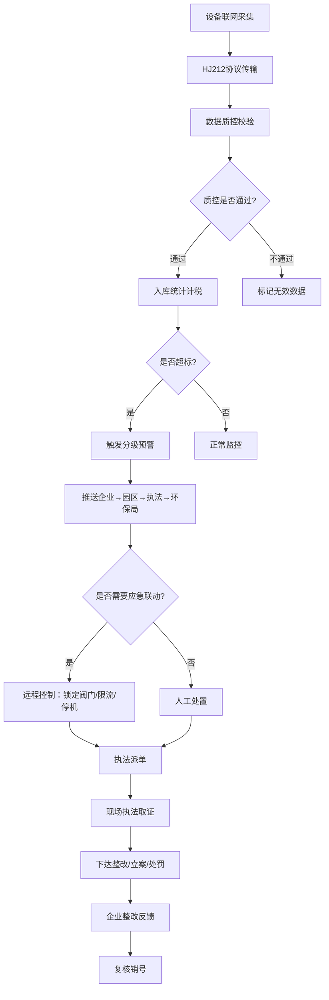
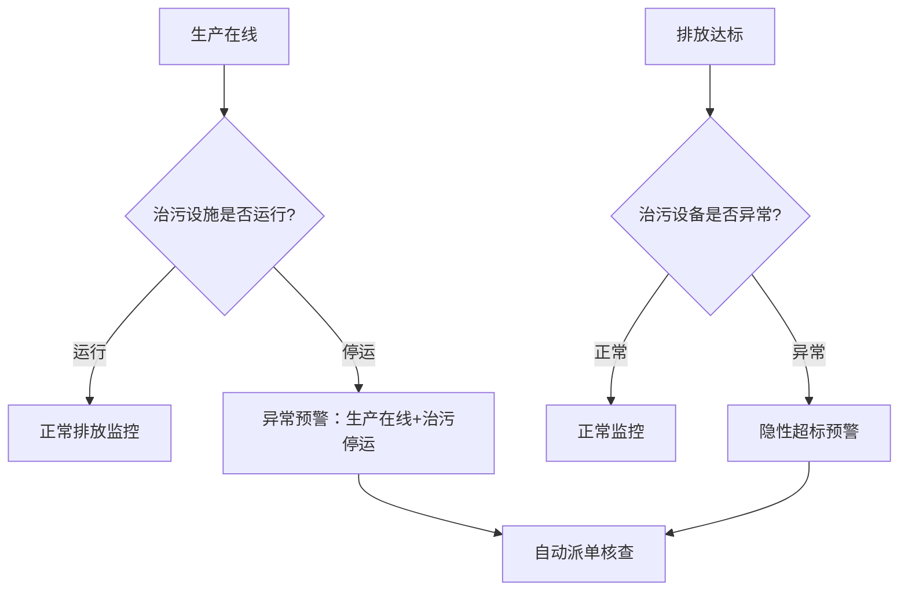
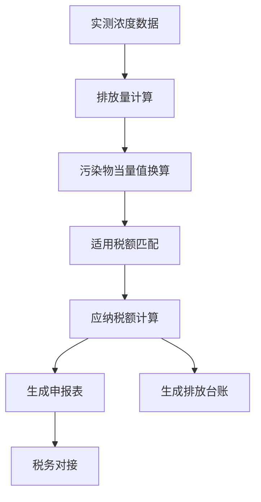

## 1. 产品概述

工业园区污染源在线监控与预警执法一体化平台，面向园区企业、运维单位、执法队伍、生态环境主管部门，实现排污监测全要素采集、数据自动质控、超标实时预警、应急自动联动、环保税自动核算、移动执法闭环、总量管控与决策可视化。平台严格遵循 HJ212/HJ216 环保在线传输标准，确保监测数据真实、准确、可追溯、不可篡改。

## 2. 核心功能

### 2.1 用户角色

| 角色 | 注册方式 | 核心权限 |
|------|----------|----------|
| 企业环保员 | 管理员分配账号 | 数据查看、超标告警接收、设备状态查看、整改上报、台账查询 |
| 运维商 | 管理员分配账号 | 设备运维、故障处理、校准记录、现场上传、质控上报 |
| 执法队员 | 管理员分配账号 | 接收派单、现场执法、笔录取证、整改督办、结案销号 |
| 环保局领导 | 管理员分配账号 | 全局监控、总量分析、企业排名、执法监督、报表导出 |

### 2.2 功能模块

1. **监管驾驶舱大屏**：园区排放总量、负荷趋势、在线设备数/在线率/数据有效率、实时超标数/预警数/企业排名、执法任务数/办结率/整改完成率
2. **实时监测与数据采集**：排污口点位备案、设备一机一码备案、废水/废气多维度实时采集、HJ212协议传输、治污设施运行状态
3. **超标预警与应急联动**：超标实时分级预警、自动远程控制（锁定阀门/限流/停机）、治理设施联动预警、预警不可关闭必须处置
4. **环保税核算与排放台账**：按实测浓度+排放量自动计算污染物当量值和应纳税额、自动生成申报表和排放台账
5. **执法管理与闭环督办**：移动执法全流程留痕、预警派单→现场检查→取证上传→整改/立案→复核销号
6. **设备运维与质控管理**：故障/校准/维护上报、现场照片/视频上传、平台审核→解除标记→运维质控审核闭环
7. **数据质控与造假识别**：超量程/零漂/满度/断数/恒值质控、AI识别数据恒定/突变跳变/反向逻辑、自动派单现场核查

### 2.3 页面详情

| 页面名称 | 模块名称 | 功能描述 |
|----------|----------|----------|
| 监管驾驶舱 | 排放总览面板 | 园区排放总量、负荷趋势图、在线率仪表盘 |
| 监管驾驶舱 | 预警态势面板 | 实时超标数、预警数、企业排名、预警趋势 |
| 监管驾驶舱 | 执法态势面板 | 执法任务数、办结率、整改完成率 |
| 实时监测 | 点位总览 | 排污口列表、状态筛选、地图分布 |
| 实时监测 | 废水监测 | COD/氨氮/总磷/总氮/pH/流量/温度实时曲线与数据表 |
| 实时监测 | 废气监测 | SO₂/NOx/VOCs/烟尘/O₂/湿度/烟温实时曲线与数据表 |
| 实时监测 | 治污设施状态 | 风机/泵/加药运行状态、电压、采样流量 |
| 超标预警 | 预警列表 | 分级预警列表、状态筛选、时间筛选 |
| 超标预警 | 预警详情 | 超标数据、联动记录、处置流程、证据链 |
| 超标预警 | 应急联动 | 远程控制面板、联动策略配置、执行记录 |
| 环保税核算 | 税额计算 | 污染物当量值、应纳税额、核算依据明细 |
| 环保税核算 | 排放台账 | 月度/季度排放台账、申报表自动生成 |
| 执法管理 | 任务列表 | 待办任务、已办任务、超时预警 |
| 执法管理 | 现场执法 | 笔录模板、取证上传、整改下达 |
| 执法管理 | 整改销号 | 整改反馈、复核审核、销号确认 |
| 设备运维 | 设备台账 | 设备列表、检定有效期、运维单位 |
| 设备运维 | 运维工单 | 故障/校准/维护工单、现场记录上传 |
| 设备运维 | 质控审核 | 质控数据审核、标记管理 |
| 数据质控 | 质控规则 | 超量程/零漂/满度/断数/恒值规则配置 |
| 数据质控 | 造假识别 | AI识别结果、疑点线索、核查派单 |

## 3. 核心流程

### 3.1 数据采集→质控→预警→执法闭环

### 3.2 治污设施联动预警

### 3.3 环保税自动核算

## 4. 用户界面设计

### 4.1 设计风格

- **主色调**：深色工业风底色（#0a0f1a 深蓝黑）+ 环保绿（#00d4aa 青绿）为主强调色 + 预警橙（#ff6b35）+ 危险红（#ff3b5c）
- **按钮风格**：圆角4px、半透明玻璃拟态、hover发光效果
- **字体**：标题使用 DIN Alternate 数字字体，正文使用思源黑体/Noto Sans SC
- **布局风格**：左侧固定导航栏 + 顶部信息栏 + 主内容区，驾驶舱大屏全屏沉浸式
- **图标风格**：线性图标（Lucide），搭配发光/脉冲动画表示状态
- **整体氛围**：科技感监控中心风格，数据可视化密集，带有微光和呼吸动效

### 4.2 页面设计概览

| 页面名称 | 模块名称 | UI元素 |
|----------|----------|--------|
| 监管驾驶舱 | 排放总览面板 | 深色全屏背景、发光数据卡片、动态折线图、环形仪表盘 |
| 监管驾驶舱 | 预警态势面板 | 脉冲红点预警列表、地图热力图、分级色彩标识 |
| 监管驾驶舱 | 执法态势面板 | 进度环形图、数据排名柱状图、状态标签 |
| 实时监测 | 点位总览 | 深色卡片网格、状态指示灯、地图标注 |
| 实时监测 | 监测曲线 | 实时刷新折线图、阈值标线、时间轴选择器 |
| 超标预警 | 预警列表 | 红橙黄三级色彩标识、时间轴、状态标签 |
| 超标预警 | 应急联动 | 控制面板UI、开关按钮、执行日志 |
| 环保税核算 | 税额计算 | 数据表格、计算公式展示、趋势图 |
| 执法管理 | 现场执法 | 表单卡片、取证上传区域、时间线 |
| 设备运维 | 设备台账 | 数据表格、状态标签、有效期倒计时 |
| 数据质控 | 造假识别 | 雷达图、异常高亮、线索卡片 |

### 4.3 响应式策略

- 桌面优先设计，监管驾驶舱大屏按 1920×1080 优化
- 侧边栏支持折叠/展开
- 数据表格支持横向滚动
- 移动端适配执法App核心功能

### 4.4 设计氛围关键词

深色科技监控中心、工业仪表盘、数据密集可视化、环保绿青光、预警脉冲红光、玻璃拟态卡片、呼吸动效
