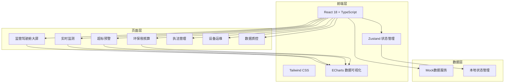
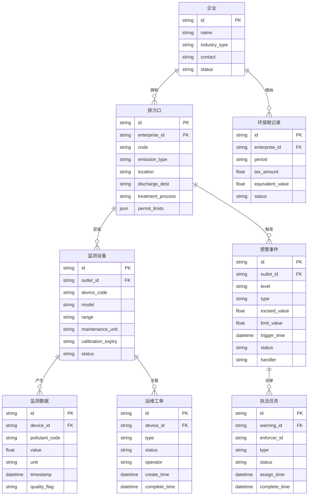

## 1. 架构设计



## 2. 技术说明

- **前端框架**：React 18 + TypeScript + Vite
- **样式方案**：Tailwind CSS 3 + CSS Variables 主题系统
- **状态管理**：Zustand
- **路由方案**：React Router DOM v6
- **数据可视化**：ECharts 5（图表）+ Lucide React（图标）
- **初始化工具**：vite-init
- **后端**：无（纯前端，Mock数据模拟）
- **数据存储**：前端内存 + Zustand持久化

## 3. 路由定义

| 路由 | 用途 |
|------|------|
| `/` | 重定向到驾驶舱 |
| `/dashboard` | 监管驾驶舱大屏（默认首页） |
| `/monitor` | 实时监测 - 点位总览 |
| `/monitor/water` | 实时监测 - 废水监测 |
| `/monitor/gas` | 实时监测 - 废气监测 |
| `/monitor/facility` | 实时监测 - 治污设施状态 |
| `/warning` | 超标预警 - 预警列表 |
| `/warning/:id` | 超标预警 - 预警详情 |
| `/warning/linkage` | 超标预警 - 应急联动 |
| `/tax` | 环保税核算 - 税额计算 |
| `/tax/ledger` | 环保税核算 - 排放台账 |
| `/enforcement` | 执法管理 - 任务列表 |
| `/enforcement/onsite` | 执法管理 - 现场执法 |
| `/enforcement/rectify` | 执法管理 - 整改销号 |
| `/maintenance` | 设备运维 - 设备台账 |
| `/maintenance/orders` | 设备运维 - 运维工单 |
| `/maintenance/quality` | 设备运维 - 质控审核 |
| `/quality` | 数据质控 - 质控规则 |
| `/quality/fraud` | 数据质控 - 造假识别 |

## 4. 数据模型

### 4.1 数据模型定义



## 5. 主题系统设计

```css
:root {
  --bg-primary: #0a0f1a;
  --bg-secondary: #111827;
  --bg-card: #1a2332;
  --bg-card-hover: #1f2b3d;
  --border: #2a3548;
  --text-primary: #e8edf5;
  --text-secondary: #8896ab;
  --accent-green: #00d4aa;
  --accent-green-dim: rgba(0, 212, 170, 0.15);
  --accent-orange: #ff6b35;
  --accent-red: #ff3b5c;
  --accent-yellow: #fbbf24;
  --accent-blue: #3b82f6;
}
```
